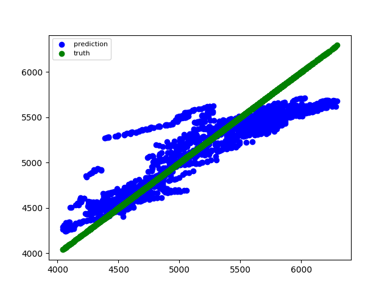

# Intent
- Showcase Azure Machine Learning AutoML time series capabilities for prediction of energy consumption.
- Dataset is sourced from [here](http://mis.nyiso.com/public/P-58Blist.htm), and contains daily energy consumption
  data for 2020 across different East Coast counties and districts.
- This does not extend into deploying the model through a web service or a managed online endpoint assuming
  some of these use cases are generally internal-facing, and require more investment in training and
  optimizing the model for internal use.

# Steps
- Python version: `python=3.7`
- To start, create a `sub.env` file with `SUB=<your subscription id>` in the root of the folder.
- A Makefile is in the ```scripts``` folder and provides an overall flow to the necessary steps.
- Provisioning of all infrastructure happens through the ```create-workspace-sprbac.sh``` shell script. This
  creates a number of environment files (config.json, variables.env) to allow the service principal
  authentication to work. Before running this file, make sure you have a file called ```sub.env``` which
  contains your subscription id in this format: ```SUB_ID=<your subscription id>```.
- The ```setup_run``` in the Makefile highlights scripts to provision the cluster, upload the dataset from the
  './input-data' folder, and setup the right tabular datasets in the workspace for execution. AutoML runs
  require a tabular dataset for execution.
- While the AutoML run could just be run from a singular script, the ```create-pipeline.py``` script creates a pipeline
  with the training dataset as the input, an AutoML training Run, and a final step to register the best model.
- Once this completes, using the best model with the test set is the next objective. This is accomplished by running the
  Makefile, with ```make evaluation``` which will output the featurization summary, forecast the values based
  upon the test set inputs, and provide some evaluation metrics based on the run.
- Additional/optional scripts include the ```publish_pipline.py``` and the ```trigger_pipeline.py``` which
  help with formalizing the pipeline as a repeatable process.
  
## Final Prediction
- Final prediction view:

